# Overview

The main topics of the labs are Microsoft Azure, Hashicorp Terraform, and GitHub.  The labs proceed in that order, with the end goal of deploying a "landing zone" into Azure, leveraging Terraform for Infrastructure as Code (IaC), and GitHub Actions for the deployment pipeline.

## Prerequisites

1. You should have received an email with a user ID and password for the lab environment.  You will use those credentials to log into an Azure tenant where you can complete the labs.
1. As per the instructions in the workshop email, you will need a GitHub account.  If you did not create your GitHub account yet, please follow the instructions in the email to create an account now.

# Lab 1: Microsoft Azure

In this lab you will log into the Azure portal and review a sample of the solution deployment.  You will also setup some Azure resources required for the subsequent labs.

## Log into the Azure portal  

1. In your web browser navigate to https://portal.azure.com.  When prompted to login, use the credentials you received via email.  
1. After logging in, you may be prompted for a tour, or a "Getting Started" page.  Dismiss these to proceed to the home page.
1. At the top of the home page you should see the following menu bar:  
    
       Below that should be 3 section headings: "Azure services", "Recent resources", and "Navigate".

## Setup Azure Cloud Shell

1. Azure Cloud Shell is a command-line interface within the Azure portal.  It even includes an basic version of Visual Studio Code!
1. To setup your own Cloud Shell, either click on the Cloud Shell icon  in the main toolbar at the top of the page
OR for a full page experience, open a new tab and navigate to https://shell.azure.com
1. The first time you open Cloud Shell the portal will display the following prompt:  
   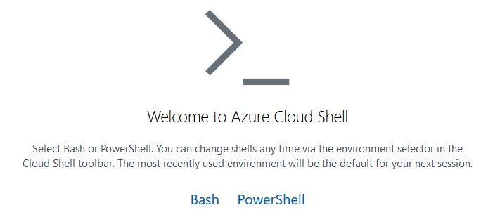
1. Select Bash or PowerShell, whichever you prefer.  You can always switch later on.
1. In the next prompt, click the "Show Advanced Settings" link, which will switch to the following prompt:
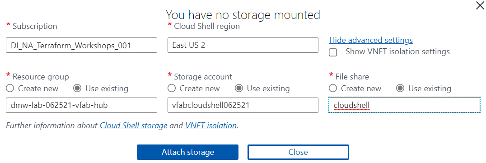
1. Change the "Cloud Shell region" to "East US 2".  _This must be selected before you can pick the "Storage account"._
1. Select the `dmw-lab-[date]-[name-prefix]-hub` Resource group.
1. For the "Storage account", select the "Use existing" option, and then select the `[name-prefix]cloudshell[date]` Storage Account.
1. For the "File share", select the "Use existing" option, and then enter "cloudshell" as the fileshare.
1. Finally, click the "Create storage" button and after the Cloud Shell is initialized you should see a command prompt.  
   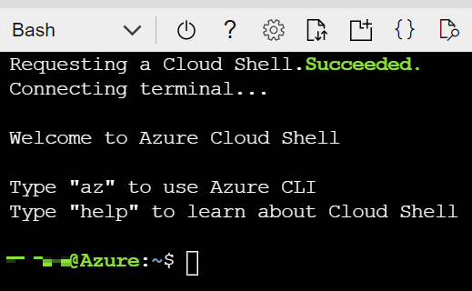

## Create a blob container for Terraform state

_*NOTE*_: Please follow this step precisely.  It is critical for subsequent steps to work correctly.

Now that you're [somewhat?] familiar with the Azure Portal, it's also good to be familiar with the commandline options for interacting with Azure.  We're going to use the Azure CLI (CommandLine Interface) to create a folder -- called a "container" -- within your storage account.  You store files, called "blobs", within the container.  We'll need that container for the upcoming Terraform labs.

Open Cloud Shell (if not already open) and execute the following command:  
`az storage container create --account-name [name-prefix]cloudshell[date] --name terraform-state`  
... entering your storage account name and the name of the container. E.g., `az storage container create --account-name jsmicloudshell062521 --name terraform-state`  

If successful the command will return the following:  
`{ "created": true }`

## Review the sample solution deployment

1. Either click on the "Resource Groups" button in the "Navigate" section near the bottom of the page:  
   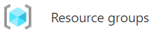  
   Or, type "resource" in the Azure search bar at the top, and click on "Resource groups" in the drop-down list.  
     
1. You should see a list of Resource Groups similar to the following:  
   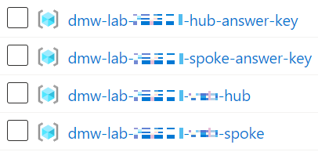    
1. Click on the `dmw-lab-[date]-hub-answer-key` Resource Group.
1. You should see the following Resource Group tab with these resources:  
   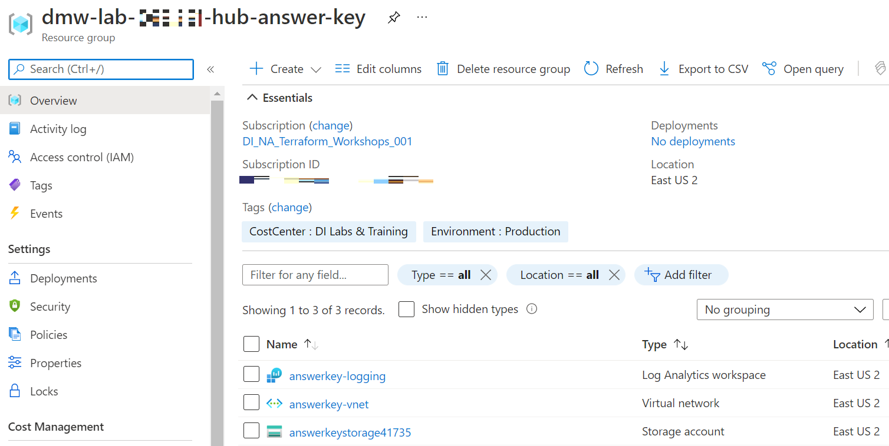
1. Click through the various resources to see their details.
1. Navigate back to the list of Resource Groups and click on the `dmw-lab-[date]-spoke-answer-key` Resource Group.
1. There should only be a VNet to review here.  
1. In the following labs you will be deploying hub and spoke Resource Groups with the same resources.

# Lab 2: Hashicorp Terraform

## Prerequisites
1. You need to complete [Lab 1: Microsoft Azure](https://github.com/InsightDI/deploying-modern-workloads-workshop/blob/main/lab-instructions.md#lab-1-microsoft-azure) before starting this lab.
1. All lab instructions are to be completed in the Azure CloudShell.

## Log into the Azure portal
1. Visit [https://portal.azure.com](https://portal.azure.com). You will be prompted to reset your password.
1. Once logged in, open the Cloud Shell.

   

## Clone the terraform-intro repository to Cloud Shell
1. Clone the [terraform-intro](https://github.com/InsightDI/terraform-intro) repository into `~/terraform-intro` by executing the following command:
```
git clone https://github.com/InsightDI/terraform-intro.git
```
2. Change into the `terraform-intro` directory:
```
cd terraform-intro
```

## Explore the Terraform CLI
Terraform ships as a binary - a single executable file. This binary is used to do everything from applying a Terraform configuration (more on that later) to interacting with the Terraform state file.
1. View the terraform binary:
```
which terraform
```
2.  Note that in Cloud Shell, the binary is stored in the `/usr/local/bin` directory, which is part of the shell's PATH:
```
env | grep PATH
```
3. View the terraform commands:
```
terraform
```
4. Make note of the `Main commands` section - we will be using a number of these during the lab.
1. Take quick glance over the `All other commands` section as well
1. Determine the version of Terraform running in Cloud Shell:
```
terraform version
```
7.  Note that Terraform is versioned with a [semantic version](https://semver.org/) number.
1. Copy the version number output from the command to your clipboard, e.g. `1.0.2`. You do not need to copy the "v" that prepends the version number as we won't be using it.
1. Because Terraform ships as a single binary, it's easy to install any version you need. Simply visit [releases.hashicorp.com/terraform](https://releases.hashicorp.com/terraform/) to see available versions.

## Set the Terraform version in code
It's best practice to set the version of Terraform you're using to write your infrastructure-as-code in the code itself.
1. Open the Cloud Shell code editor

   
1. Expand the `terraform-intro` directory from the FILES tree
1. Open the file named `providers.tf` and find the `terraform {}` block
1. Update the `required_version = "~> YOURVERSIONHERE"`, replacing "YOURVERSIONHERE" with the version you copied to your clipboard in the previous step.
   - Please leave the "~> " in front of your version. This is called the [pessimistic contstraint operator](https://www.terraform.io/docs/language/expressions/version-constraints.html#gt--1) which allows for variation in the patch number of the required version.
1. Your `providers.tf` file should look something like this, though your version may vary:
```
terraform {
  required_version = "~> 1.0.2"
  ...
}
```
6. Hit `CTRL + S` to save the file

## Configure the AzureRM provider
Terraform interacts with one or more APIs (and thus, clouds) via providers. Therefore, you will typically see one or more provider configurations in Terraform code. In this section, we're going to discover the latest provider version for `azurerm`, which is used to interact with the Azure Resource Manager API.
1. Official Terraform providers can be found in the Terraform Registry at [registry.terraform.io](https://registry.terraform.io). Open a web browser an navigate to https://registry.terraform.io now.
1. Click "Browse Providers"


3. Select "Azure" from the list of providers
1. From the "Overview" tab, copy and paste the azurerm provider VERSION to your clipboard
1. Note the "Documentation" tab - this is where all of the documentation for the provider is located - as in, if you're developing Terraform against Azure, you will use this documentation extensively :)
1. Go back to your editor in Cloud Shell and open `providers.tf` if it isn't already open
1. Find the `required_providers` block, and within, the `azurerm` block.
1. Edit the `version = "VERSION"` and paste in the version you found from the registry
1. Your `providers.tf` file should look something like this, though your azurerm version may vary:
```
terraform {
  ...
  required_providers {
    azurerm = {
      version = "2.68.0"
    }
  }
  ...
}
```
10. Hit `CTRL + S` to save the file

## Initialize Terraform
Any time you make changes to the `terraform {}` block, you will need to initialize Terraform. The same is true for the first time you go to run a Terraform configuration.
1. Use the Terraform CLI from Cloud Shell to initialize Terraform:
```
terraform init
```
2. Notice how you didn't pass any flags into the command to tell it where to find your Terraform configuration files? That's because Terraform CLI reads through the directory from where it is executed and loads in all of the files ending in "[.tf](https://www.terraform.io/docs/language/files/index.html#file-extension)" automatically. Neat!
3. From the code editor, refresh the FILES window.


4. You should now see the following additional files or directories:
```
.terraform/
.terraform.lock.hcl
```
5. Expand the `.terraform/` directory tree as far as it will let you. This directory is where Terraform stores all provider information.
   - This directory should not be checked into source code
6. Open the `.terraform.lock.hcl` file.
   - This file contains version information for all providers references in the Terraform configuration, including hashes used to calculate the provider configuration in order to provide consistency from one run to the next.
   - This file should be checked into source code

## Update Terraform to reflect your unique environment
We're almost ready to deploy some resources in Azure, but first, you'll need to update your variables to reflect your unique environment.
1. Open `variables.tf` in the editor. Variables define values that can be input into Terraform at plan, apply, and destroy time.
   - Some variables, such as `location` have a default value that will be used if no value is supplied
   - Other variables are required input - they can either be defined as an environment variable `TF_VAR_<var name>`, defined in a "tfvars" file, or manually entered at plan/apply/destroy time when prompted by the Terraform CLI
1. Open `terraform.tfvars` in the editor - we'll use this file to define our variable values.
1. Set `prefix = "YOURPREFIXNAME"` to your first initial and lastname, e.g. `dbenedic`
1. Open the [Azure Portal](https://portal.azure.com) and find the name of your unique "spoke" resource group. For example, my resource group is named `dmw-lab-062521-dben-spoke`.
1. Copy the resource group name and paste it into the `terraform.tfvars` file value for `resource_group_name`. Your tfvars file should look something like this (your strings will vary):
```
prefix = "dbenedic"
resource_group_name = "dmw-lab-062521-dben-spoke"
```
6. Hit `CTRL + S` to save the file

## Run a Terraform Plan
Terraform is great because it has a workflow that allows you to see the predicted changes before you apply them. This is known as a "plan".
1. From Cloud Shell, within the `terraform-intro` directory, run the following to generate a plan:
```
terraform plan
```
2. Note that our plan is NOT making any changes yet, it's just communicating with the Azure API and comparing what exists (reality) vs. what we have in our code (source of truth).
1. Your plan should show a bunch of resource "adds" with a green "+"
1. The plan summary should show `2 to add, 0 to change, 0 to destroy`
   - The summary allows you to see, at-a-glance, what resources Terraform thinks it's going to add, change, or destroy when it is run.
   - "Adds" are typically ok, but still worth looking at closely.
   - "Changes" or "Destroys" are destructive actions that require understanding before applying the plan.
1. It is best practice to output a plan and use that plan output to run an apply against that plan to ensure consistency between the plan and apply phases.

## Run another Terraform Plan, and output the plan
1. From Cloud Shell, within the `terraform-intro` directory, run the following to generate a plan and store its output:
```
terraform plan -out myplan.tfplan
```
2. Run `ls -la | grep "myplan.tfplan"` from Cloud Shell to stat the plan file
1. Run `cat myplan.tfplan` from Cloud Shell - note that the plan is not readable!

## Run Terraform Apply to create some stuff!
1. From Cloud Shell, within the `terraform-intro` directory, run the following to take our plan output and "make it so":
```
terraform apply myplan.tfplan
```
2. If you get an error during your apply, your plan will no longer be valid (by design). You can 1) rerun the plan and outupt a new plan or 2) run `terraform apply` and manually approve the plan when prompted
1. Let the apply run - it will tell you when it's finished!
1. Click on the output labelled `url = https://<some_fqdn>` - this will open the web page you just deployed to Azure... pat yourself on the back.
   - Note: when clicking the url from Cloud Shell, you may see an errant `"` at the end of your url in the address bar - be sure to remove that and try your url again!
1. Navigate to the [Azure Portal](https://portal.azure.com) and checkout your resources Terraform deployed for you in the spoke resource group

## Run Terraform Apply again - seeing any changes?
1. From Cloud Shell, within the `terraform-intro` directory, run the following to plan and apply with auto approval:
```
terraform apply -auto-approve
```
1. Note what Terraform does when there are no changes amongst your Terraform code, the state file, and Azure

## Explore Terraform state
Terraform uses a state file to keep track of its last-known state of resources it has applied. The statefile is important because it allows future Terraform plans and applies to happen incrementally and keeps your infrastructure idempotent.
1. After each Terraform apply, a statefile version is created. If it's the first apply, the statefile itself is also created.
1. From Cloud Shell, within the `terraform-intro` directory, run the following to see the statefiles that were created:
```
ls | grep tfstate
```
3. Note that you have 2 statefiles - a `terraform.tfstate` and a `terraform.tfstate.backup`
1. Run the following command to output the statefile to stdout:
```
cat terraform.tfstate
```
5. A few things of note about the statefile:
   - It's in JSON format
   - It has a version number
   - It tracks the version of Terraform that was used to generate it
   - It has a GUID called "lineage"
   - It contains outputs from the Terraform apply
   - It contains a record of the resources it provisioned

## Moving a local statefile to a remote backend
Part of Terraform's power lies in its statefile. When you start to grow a team that works with Terraform, you need a shared location to store, read, and write statefiles. Enter remote state.
1. Open `providers.tf` from the editor again
1. Find the commented-out block labelled `backend "azurerm"`. A backend is used to define a remote backend - in this case an Azure Storage Account. We're going to use a storage account that was pre-provisioned in your Azure lab environment.
1. Highlight the entire block of code that is commented out and hit `CTRL + /` to uncomment it.
1. From the Azure Portal, find the storage account you created in your lab resource group. Note the storage account name.
1. Still from the Azure Portal, locate the "Containers" section on the navigation bar under the "Data storage" heading.
1. Make note of the container name.
   - If you haven't already created a container or don't see one in the portal, create one now.
1. Back in the Cloud Shell editor, in the `providers.tf` file, update the `storage_account_name` and `container_name` to reflect the values you just looked up in the portal.
1. Run the following from Cloud Shell, following the prompts to move your statefile when asked:
```
terraform init
```
1. Once you have successfully moved the state into the remote backend, you may remove the local statefiles:
```
rm terraform.tfstate && rm terraform.tfstate.backup
```
2. Run another terraform apply to confirm everything is working:
```
terraform apply -auto-approve
```
3. IMPORTANT!!! Terraform state contains HIGHLY SENSITIVE information and should be SECURED accordingly! Same goes for source control, so don't check it in, ok?
   - Bonus points if you can figure out how we're preventing state from getting checked into the `terraform-intro` repo...

## Cleanup
Alas, all good things must come to an end. Time to destroy some stuff! After all, [rapid elasticity](https://nvlpubs.nist.gov/nistpubs/Legacy/SP/nistspecialpublication800-145.pdf) is one of the reasons why we use the cloud, right? BURN IT DOWN!
1. From Cloud Shell, within the `terraform-intro` directory, run the following to tear down our deployment:
```
terraform destroy
```
2. Review the items that Terraform is planning destroy (like a plan, but in reverse!) and type "yes" to approve.
1. Wait for Terraform to finish destroying stuff.
1. You're done! Congrats!

# Lab 3: GitHub

## Fork the workshop code from the main GitHub repo

1. Open a new tab in your browser and navigate to the workshop GitHub repository: https://github.com/InsightDI/deploying-modern-workloads.  In the upper right-hand corner click the "Fork" button.  
   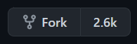  

1. GitHub will prompt you to select your personal GitHub org.  
   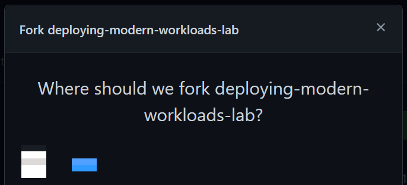  

1. Click your personal GitHub organization.  
   GitHub will popup a message stating that it is forking the repo.  When complete it will display the forked repo in your org.

1. Next, click on the green "Code" button to clone the repo into your Cloud Shell.  
     

1. And then click the clipboard button next to the URL.
   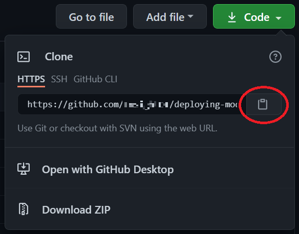  

1. Return to the Azure portal and open Cloud Shell if it's not already open.  At the Cloud Shell command prompt type `git clone <space>` and then right-click within Cloud Shell and select "Paste".  You should end up with  
`git clone https://github.com/InsightDI/deploying-modern-workloads.git`

1. The `git clone...` comand will prompt for your GitHub username.  If you don't recall your username, just go to GitHub and click on the profile button in the upper right-hand corner.  
   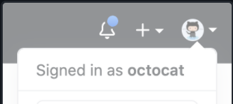  
   Then it will prompt for your password, for which you should enter your GitHub Personal Access Token, which you created (and stored safely and securely 😁) when following the prerequisites in the workshop email.  Once logged in, GitHub will clone the repo to your Cloud Shell session.

1. When the `git clone...` command completes, list the files in the directory (using the `ls` command) to verify that you now have a "deploying-modern-workloads" folder with Terraform code in it.  

## Review the Terraform code

The Terraform code in this lab completes your landing zone deployment.  After executing this Terraform code (in the upcoming GitHub labs) your hub and spoke Resource Groups will have the same resources as you reviewed in the "answer key" Resource Groups, although they will be named differently.

1. In the toolbar at the top of Cloud Shell click the "Open editor" button:  
   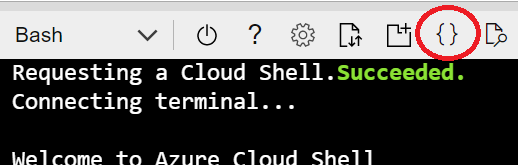

1. Expand the "deploying-modern-workloads" folder and open the `variables.tf` file.  See how variables are defined with names, descriptions, types, default values, and even validation.

1. Open the `locals.tf` file to see how local values can be fefined to be used throughout your Terraform code.  Change the `YOURNAMEHERE` value and hit Ctrl-S to save.

1. Open the `hub.tf` file to see how it creates a random number, a virtual network with multiple subnets, and then peers the virtual network with the spoke virtual network.  
It also creates a Log Analytics workspace for monitoring your resources, and then it creates a storage account and configures some of the storage account's metrics to be routed to the Log Analytics workspace.  
Finally it creates an Azure Firewall within the `firewall` subnet and provides it a public IP address.

1. Next, open the `spoke.tf` file.  It also creates a random number, a virtual network with a subnet, and then peers the virtual network with the hub virtual network.  
Then it configures some network routing for the firewall.  
Finally it creates an Azure Container Instance and configures its networking.

1.  Open `outputs.tf` to see the values that are output when the Terraform deployment completes.

1. Finally, open the `providers.tf` file to see how the code configures the `azurerm` and `random` Terraform providers.

1. Close the Cloud Shell editor by clicking the ellipses in the upper right-hand corner of Cloud Shell and selecting "Close Editor", or hit Ctrl-Q.

# Lab 3: GitHub

## Review the GitHub workflow code

In the following steps you will review the first GitHub workflow.

1. Open Cloud Shell, if not open already.

1. Open the editor.  

   

1. Expand the `deploying-modern-workloads` folder, and then the `.github` and `workflows` folders under that.  

   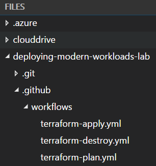

1. Within the `workflows` folder open the `terraform-plan.yml` file.

1. The file is somewhat self-documenting, but see below for some highlights.  (Complete GitHub workflow syntax can be found [here](https://docs.github.com/en/actions/reference/workflow-syntax-for-github-actions).)  
   1. `on`: For declaring workflow triggers.  
   1. `jobs`: The list of jobs that run within the workflow.  Each job is composed of multiple steps.  This job includes steps that 1) check out the source code, 2) install Terraform, 3) execute `terraform init` and 4) execute `terraform plan`.  
   1. Note how the `env:` property configures environment variables for the subsequent steps.  The Azure provider for Terraform uses these environment variables to connect to the Azure subscription.  For example, the `ARM_CLIENT_ID: ${{secrets.DMW_ARM_CLIENT_ID}}` code sets an environment variable named "ARM_CLIENT_ID" to the secret value named "DMW_ARM_CLIENT_ID".  You will configure these secrets in the next section of the lab.

## Create GitHub Secrets in the Workshop Repository

1. Navigate to GitHub and to the "deploying-modern-workloads-lab" repo.  Make sure GitHub is open in a separate tab from the Azure portal as you'll need to navigate between the two tabs.

1. Click on 1) the "Settings" tab, 2) the "Secrets" tab, and 3) the "New repository secret" button.  

   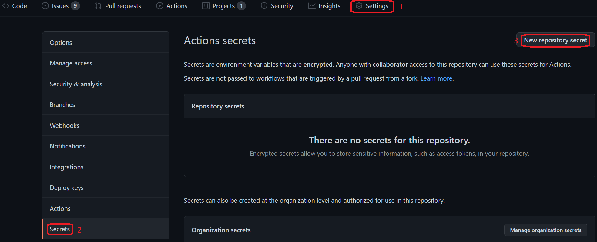

   You should see the "New secret" form.  

   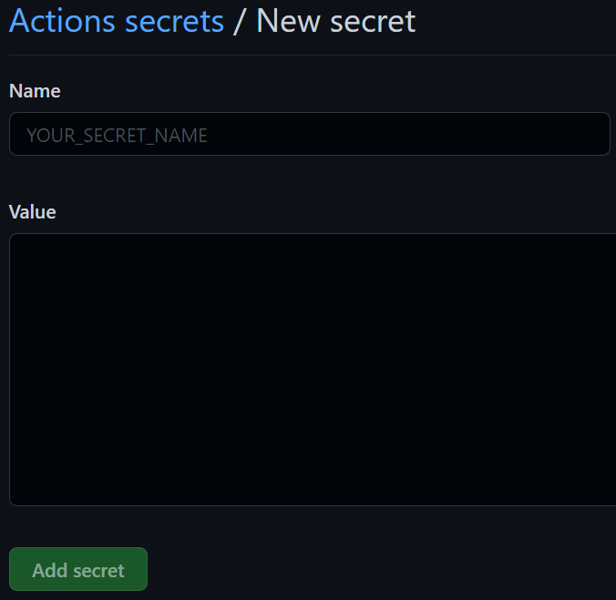  

1. Enter "DMW_ARM_CLIENT_ID" as the secret name.  

1. Now switch to the browser tab with the Azure portal.  Navigate to the Resource Group named "dmw-lab-[date]-[name-prefix]-hub" (e.g., "dmw-lab-062521-jsmi-hub") and then open the Key Vault named "[name-prefix]-kv-[date]-75155" (e.g., "jsmi-kv-062521-75155").

1. Click on the "Secrets" tab on the left navigation panel to list the current secrets.  

   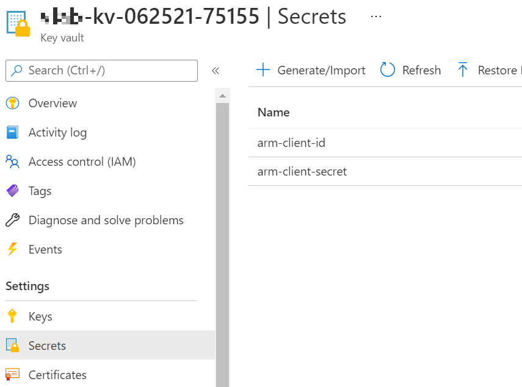

1. Click on the "arm-client-id" secret, and then click on the current version.  

   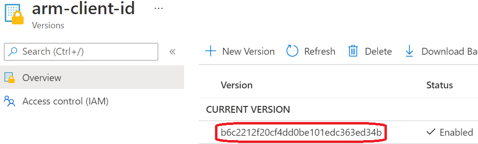

1. Click on the copy button next to the "Secret value".  

   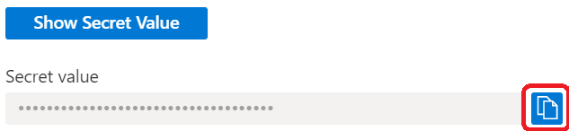  

1. Switch back to the browser tab with GitHub and paste the secret into the secret value.  Then click the "Add secret" button.

1. GitHub will return to the list of secrets, which now includes the "DMW_ARM_CLIENT_ID" secret.  Click the "New repository secret" again to add the "DMW_ARM_CLIENT_SECRET".  

1. Return to the browser tab with the Azure portal to get the "arm-client-secret" secret, then return to GitHub and enter its value for the "DMW_ARM_CLIENT_SECRET" secret, and finally save the GitHub secret.  

1. Next, to populate the "DMW_ARM_SUBSCRIPTION_ID" and "DMW_ARM_TENANT_ID" secrets, let's use another common Azure CLI command.  To get the subscription ID and tenant ID, return to the Azure portal and open Cloud Shell.  Then execute the following command: `az account show`.  The command will return a JSON object.  The "id" property is the subscription ID and the "tenantId" property is the tenant ID.  Copy their values to add the two new GitHub secrets.  (Do NOT copy the quotes!)

## Execute the GitHub Workflow to Run the Terraform Deployment

In this portion of the lab we'll first create a `.tfvars` file with the detailed configuration of our deployment, and then we'll execute the Terraform deployment using a GitHub workflow.  (Read [here](https://www.terraform.io/docs/language/values/variables.html#variable-definitions-tfvars-files) for details on `.tfvars` files.)

1. Open Cloud Shell if it's not already open.  

1. Open the editor, then expand the `deploying-modern-workloads` folder and open the `variables.tf` file.  Note that the `hub_resource_group`, `spoke_resource_group` and `prefix` are all required variables because they do not have default values.  The `location` variable is not required because it has a default value of `eastus2`.

1. We are going to create a Terraform configuration file -- a `.tfvars` file -- that contains values for the variables that will shape our deployment.

1. At the Cloud Shell commandline, switch to the `deploying-modern-workloads` folder using `cd deploying-modern-workloads`.  The command prompt should now be "[your-name]@Azure:~/deploying-modern-workloads$".

1. At the commandline enter `code lab.tfvars`.  This should open the editor with an empty file.  The top bar above the editor should display "lab.tfvars".

1. Enter the following in the editor, replacing "[date]" and "[name-prefix]" as needed:  
   ```
   hub_resource_group = "dmw-lab-[date]-[name-prefix]-hub"
   spoke_resource_group = "dmw-lab-[date]-[name-prefix]-spoke"
   prefix = "[name-prefix]"
   ```
   For example,
   ```
   hub_resource_group = "dmw-lab-062521-jsmi-hub"
   spoke_resource_group = "dmw-lab-062521-jsmi-spoke"
   prefix = "jsmi"
   ```

1. Hit Ctrl-S to save your changes and then close the editor (Ctrl-Q).

1. Before you can commit your new file to the GitHub repo you'll need to configure some git settings.  At the commandline enter the following 2 commands:  
   ```
   git config --global user.email "[name]@insightworkshop.us"
   git config --global user.name "[Your Name]"
   ```
   For example,
   ```
   git config --global user.email "johnsmith@insightworkshop.us"
   git config --global user.name "[John Smith]"
   ```

1. Stage your changes with the following command: `git add lab.tfvars`

1. Commit your changes to the GitHub repo with: `git commit -a -m "Added .tfvars file"`.  Note that you are currently working directly on the "main" branch, which is not normally recommended.  (But we won't tell anyone.)

1. Finally, push your commit to the remote repo with: `git push`.

In this final portion of the lab we will leverage the GitHub workflows you reviewed above to deploy Azure resources to the lab environment.

1. Open another browser tab (if needed) to navigate to your GitHub account where you forked the lab repo, and navigate to the lab repo.  The URL will be `https://github.com/[your-account-name]/deploying-modern-workloads`.

1. Click on the "Actions" tab.  

   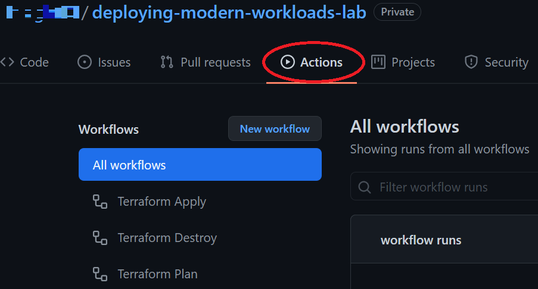

1. Recall that in this lab's first step you reviewed the code in `terraform-apply.yml`, `terraform-destroy.yml` and `terraform-plan.yml`.  Now you can see the `name` property of each workflow listed below the blue "All workflows" button.

1. Click on the "Terraform Plan" workflow and then click on the "Run workflow" button.  

   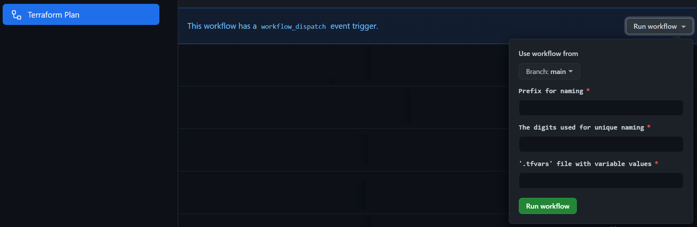

1. The workflow will prompt for 3 inputs.  Enter your name prefix (e.g., "jsmi"), the date digits (e.g., "062521") and the name of your `.tfvars` file (i.e., "lab.tfvars").  Then click the "Run workflow" button.

1. After a few seconds the workflow should display in the list of workflow runs.  

   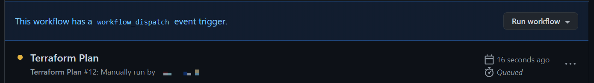

1. When the workflow run completes it will display either success () or fail ().

1. Whether the workflow succeeded or failed, click the workflow name in the list of runs to view the execution summary.  

   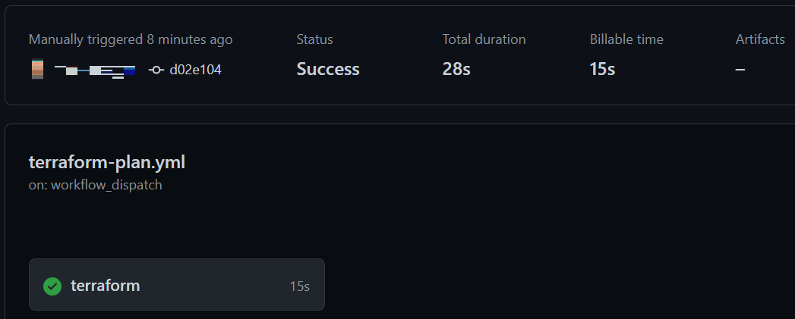

1. To view the run details click the "terraform" job name in the lower left-hand corner of the summary.  

   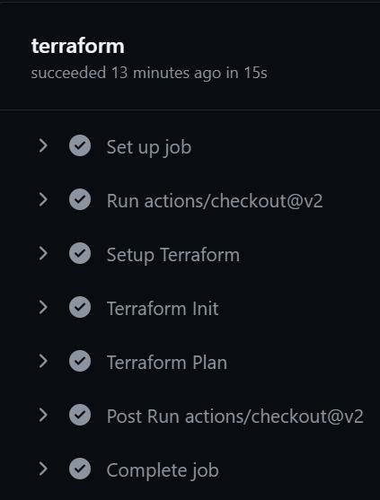

1. You can expand any of the individual steps, but be sure to expand the "Terraform Plan" step to see the plan Terraform generated.

1. Next, click on the "Actions" tab to return to the list of workflows and run the "Terraform Apply" workflow.  When the "apply" runs successfully, go to the Azure portal to view the newly added resources in your hub and spoke Resource Groups.  Also be sure to view the details of the workflow run in GitHub.

1. After you've verified that your Azure resources were deployed successfully, let's tear down that deployment.  To do that, click the "Actions" button again to return to the list of workflows and run the "Terraform Destroy" workflow.  Once it completes successfully verify that the resources have been destroyed in Azure.  Also view the details of the workflow run in GitHub.

## Go Kick Back and Relax!

You've done it!  You've completed the labs in the "Deploying Modern Workloads" workshop!  We sincerely hope you learned a lot and enjoyed the experience.

You have the lab code and all the references to helpful Azure, Terraform and GitHub documentation.  We hope that will help kickstart your automation efforts.  Please reach out if every we can help accelerate your automation journey!
